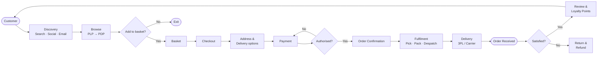
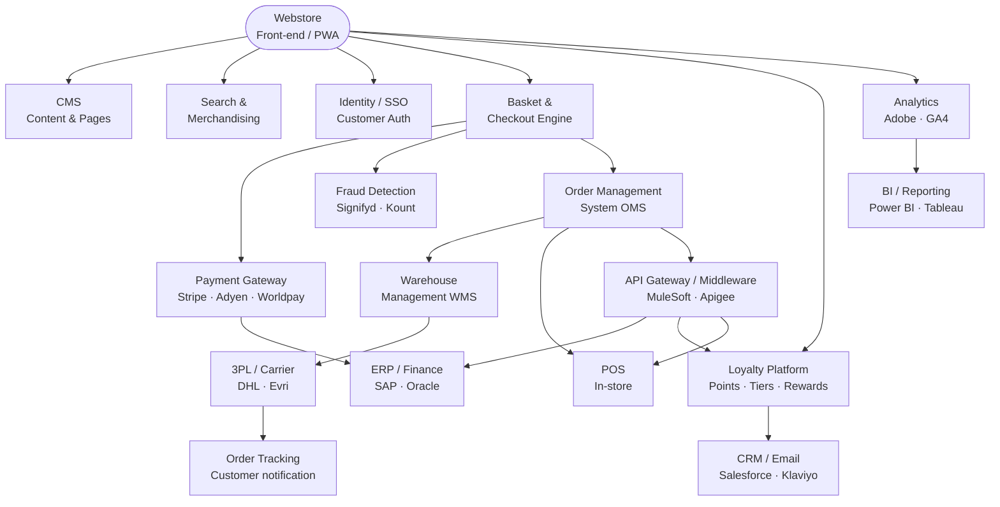
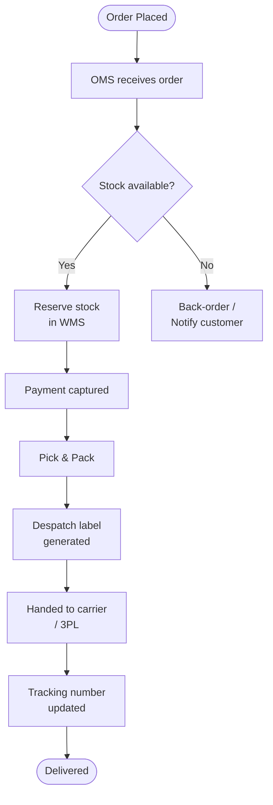
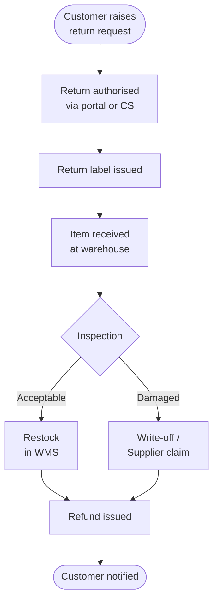
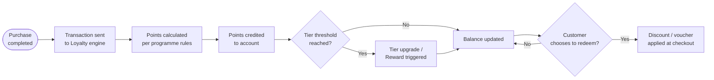

# Ecommerce overview

Ecommerce covers the buying and selling of goods and services through digital channels. Based on delivery experience across clients including **Estee Lauder**, **Shell GO+**, **Costa Coffee**, **Vodafone**, **Argos**, **Homebase**, **Jewson** and **LeasePlan**, ecommerce takes several distinct forms:

| Flavour | Description | Example Clients |
|---|---|---|
| **B2C Retail** | Direct-to-consumer online stores with product discovery, checkout, and payment | Argos, Homebase, Estee Lauder |
| **Prestige / Luxury DTC** | Multi-brand, curated digital storefronts for high-value goods with premium UX | Estee Lauder (17 global brands, NA & EMEA) |
| **Loyalty-Led Commerce** | Transaction-linked programmes driving repeat purchase and customer retention | Shell GO+ (10M+ users), Costa Coffee |
| **B2B Trade** | Trade account portals for bulk ordering, invoicing, and account management | Jewson |
| **B2B/B2C Hybrid** | Platforms serving both business and consumer customers with tailored journeys | LeasePlan (fleet leasing) |
| **Telco / Subscription** | Service and product bundles sold online, often with multi-play or subscription models | Vodafone (Quad Play) |

# Glossary of common ecommerce terms

| Term | Definition |
|---|---|
| **AOV** | Average Order Value — average spend per completed transaction |
| **B2B** | Business-to-Business — commerce between companies |
| **B2C** | Business-to-Consumer — commerce sold directly to end customers |
| **Cart Abandonment** | When a customer adds items to basket but does not complete checkout |
| **CMS** | Content Management System — platform for managing digital content and product pages |
| **Conversion Rate** | Percentage of site visitors who complete a purchase |
| **CRO** | Conversion Rate Optimisation — improving site design and flows to increase purchases |
| **DTC** | Direct-to-Consumer — brand sells directly without retail intermediaries |
| **Headless Commerce** | Decoupled front-end presentation layer from back-end commerce engine, connected via APIs |
| **Loyalty Programme** | Scheme rewarding repeat purchases with points, tiers, or perks |
| **OMS** | Order Management System — tracks orders from placement through to fulfilment |
| **PCI DSS** | Payment Card Industry Data Security Standard — security standard for card payment processing |
| **PDP** | Product Detail Page — page showing a single product with full details |
| **PLP** | Product Listing Page — page showing a category or search results grid |
| **POS** | Point of Sale — in-store or kiosk system where purchase transactions occur |
| **Private Label Credit Card** | Store-branded credit card issued to customers for financing or loyalty benefits |
| **PWA** | Progressive Web App — web application with native app-like experience |
| **SKU** | Stock Keeping Unit — unique identifier for a specific product variant |
| **UGC** | User-Generated Content — reviews, ratings, and photos submitted by customers |
| **3PL** | Third-Party Logistics — outsourced warehousing and delivery provider |
| **WMS** | Warehouse Management System — manages inventory, picking, packing, and despatch |

# Generic ecommerce journey

The ecommerce customer journey spans from initial awareness through to post-purchase engagement. The diagram below shows the end-to-end flow across the key stages.

## Systems integration map

The diagram below shows the key systems a Project Manager needs to track across a typical ecommerce delivery, grouped by capability layer.

## Key journey milestones

| Stage | Goal | Common Metric |
|---|---|---|
| Discovery | Drive relevant traffic | Sessions, Impressions, CTR |
| Browse | Engage and inspire | Pages per session, Bounce rate |
| Decision | Convert to basket | Add-to-cart rate |
| Checkout | Reduce friction to purchase | Checkout abandonment rate |
| Payment | Authorise securely and quickly | Authorisation rate, PCI compliance |
| Fulfilment | Ship accurately and on time | On-time despatch rate, Error rate |
| Post-purchase | Build loyalty and advocacy | NPS, Return rate, Loyalty enrolment |

# Generic ecommerce processes

## Order management process

## Returns and refunds process

## Loyalty accrual and redemption process

# List of typical integrations for ecommerce systems

| Integration | Function |
|---|---|
| **Payment Gateway** (e.g. Stripe, Adyen, Worldpay) | Processes card and alternative payment method authorisations |
| **Fraud Detection** (e.g. Signifyd, Kount) | Scores transactions and flags suspicious orders in real time |
| **Order Management System (OMS)** | Orchestrates order lifecycle from placement to fulfilment |
| **Warehouse Management System (WMS)** | Manages stock levels, picking, packing, and despatch |
| **3PL / Carrier** (e.g. DHL, Evri, Royal Mail) | Handles last-mile delivery and returns logistics |
| **CMS** (e.g. Contentful, Adobe Experience Manager) | Manages product content, banners, and landing pages |
| **PIM** (Product Information Manager) | Single source of truth for product data and attributes |
| **Search & Merchandising** (e.g. Algolia, Searchspring) | Powers site search, faceted filtering, and product ranking |
| **Analytics** (e.g. Adobe Analytics, GA4) | Tracks user behaviour, funnel performance, and revenue attribution |
| **CRM / Email** (e.g. Salesforce, Klaviyo) | Customer data management, segmentation, and marketing automation |
| **Loyalty Platform** (e.g. Loyalty Lion, bespoke) | Manages points accrual, redemption, tiers, and rewards |
| **Reviews & UGC** (e.g. Bazaarvoice, Yotpo) | Collects and displays customer ratings, reviews, and photos |
| **ERP** (e.g. SAP, Oracle) | Finance, inventory, and supply chain back-office integration |
| **API Gateway / Middleware** (e.g. MuleSoft, Apigee) | Orchestrates data flows between commerce systems and third parties |
| **CDN** (e.g. Cloudflare, Akamai) | Delivers static assets globally for fast page load times |
| **Identity / SSO** (e.g. Auth0, Okta) | Manages customer authentication and single sign-on across channels |
| **POS** (Point of Sale) | Links in-store transactions to online profiles for omnichannel data |
| **Tax Engine** (e.g. Avalara, Vertex) | Calculates jurisdiction-appropriate tax at checkout |

# Output

See [Ecommerce-Journey.html](Ecommerce-Journey.html) for the rendered version with Mermaid diagrams, tables, and print-friendly formatting.
